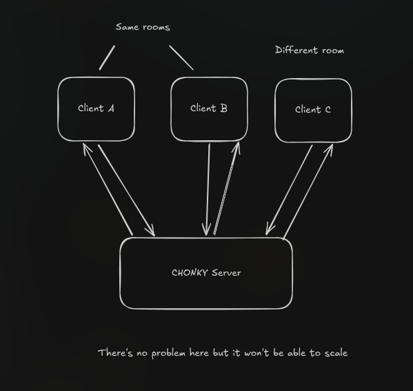
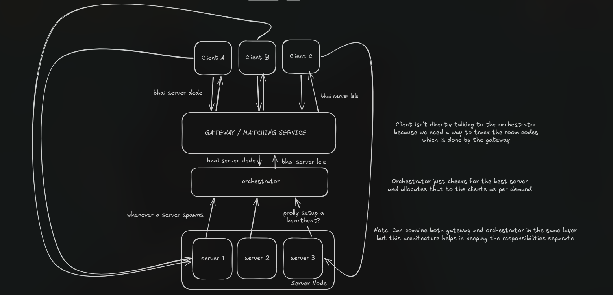

# 🟥 Box Game

A real-time multiplayer platformer game built with HTML5 Canvas, Socket.IO, and Node.js. Players jump across platforms to collect a pulsing target — whoever collects the most wins the room.


---

## ✨ Features

- **Real-time multiplayer** — rooms support up to 20 players simultaneously
- **Private rooms** — create a room and share the code with friends
- **Live leaderboard** — score rankings update in real time
- **Delta-state networking** — only changed state is broadcast each tick, keeping bandwidth minimal
- **Spatial grid collision** — O(1) platform lookup for server-side physics
- **Particle system** — pooled, zero-allocation particle effects on the client
- **Configurable tick rate** — server tick rate is tunable via environment variable
- **Horizontally scalable** — game-server pods self-register with the server-manager; the gateway routes each room to the least-loaded server

---

## 🏛️ Architecture

### Old Architecture

All clients connected directly to a single monolithic game server. Simple, but impossible to scale.



### New Architecture

A layered system with a **Gateway**, a **Server Manager (orchestrator)**, and a fleet of **game-server pods**.



#### How a room is created

1. **Client → Gateway** (`GET /createRoom`): The client asks the gateway to allocate a room.
2. **Gateway → Server Manager** (`GET /assign`): The gateway asks the orchestrator for the least-loaded game-server. The server-manager maintains a min-heap sorted by active connections and returns the best server's `hostIp` and internal port.
3. **Gateway → Client**: Returns `{ hostIp, port, roomID }`. The gateway stores the room-code → server mapping in memory (in-process map; Redis migration is a TODO).
4. **Client → Game Server** (WebSocket `wss://server.boxgame.shadyggs.xyz:<port>`): The client opens a Socket.IO connection directly to the assigned game-server pod.

> The client connects **directly** to the game-server pod over WebSocket — it never proxies game traffic through the gateway. The gateway is only involved during matchmaking.

#### TLS & port mapping (production)

Game-server pods use `hostNetwork` and listen on **internal** ports **30000–31000** on the VM. The browser requires `wss://` (mixed-content rules). A **host-level Nginx stream** block terminates TLS on **external** ports **20000–21000** and forwards plaintext to the matching internal port (`external + 10 000 = internal`).

```
Browser → wss://server.boxgame.shadyggs.xyz:20426 (TLS)
        → Nginx stream :20426
        → 127.0.0.1:30426 (game-server pod, plaintext)
```

Port blocks are generated by `scripts/gen-stream-ports.sh` and included by `nginx-gameserver-stream.conf`.

---

## 🗂️ Repository Structure

```
BoxGame/
│
├── client/                    # Static frontend (HTML5 Canvas + Socket.IO)
│   ├── index.html             # Entry point / lobby UI
│   ├── index.js               # Lobby logic, room creation/joining, HUD
│   ├── game.js                # Canvas renderer, particle system, input handling
│   ├── styles.css             # Lobby & game styles
│   ├── icon.png               # App icon / banner
│   └── heart.png              # UI asset (lives / branding)
│
├── server/                    # Game server (Node.js + Socket.IO)
│   ├── server.ts              # Physics loop, room management, socket events,
│   │                          #   self-registers with server-manager on startup
│   ├── config.yaml            # Example k8s Pod spec for a game-server pod
│   ├── package.json
│   └── Dockerfile
│
├── gateway/                   # Matchmaking / room-allocation service (Bun + TypeScript)
│   ├── index.ts               # Express app; exposes /createRoom and /add
│   ├── routes/
│   │   ├── createRoom.ts      # Allocates a room: queries server-manager, maps code→server
│   │   ├── addToRoom.ts       # Adds a client to an existing room
│   │   └── removeFromRoom.ts  # Removes a client from a room
│   ├── helper/
│   │   └── generateRoom.ts    # Generates random room codes
│   ├── types/
│   │   └── server.ts          # Shared Server type
│   ├── package.json
│   ├── tsconfig.json
│   └── Dockerfile
│
├── server-manager/            # Orchestrator / load-balancer (Bun + TypeScript)
│   ├── index.ts               # Express app; exposes /assign and /register
│   ├── routes/
│   │   ├── assignServer.ts    # Pops best server from heap, increments connections, returns it
│   │   └── handleRegister.ts  # Game-server pods POST here on startup to join the pool
│   ├── helper/
│   │   └── heap.ts            # Min-heap sorted by active connections (O(log n) assign)
│   ├── types/
│   │   └── server.ts          # Shared Server type { hostIp, port, connections }
│   ├── package.json
│   ├── tsconfig.json
│   └── Dockerfile
│
├── scripts/
│   └── gen-stream-ports.sh    # Generates Nginx stream server blocks for ports 20000–21000
│
├── archRef/
│   ├── ArchOld.png            # Monolithic architecture diagram
│   └── ArchNew.png            # Distributed architecture diagram
│
├── nginx-gameserver-stream.conf  # Host-level Nginx stream config (TLS termination)
├── k8s.yaml                   # Production Kubernetes manifests (all services)
├── k8s.local.yaml             # Local/dev Kubernetes manifests
├── .env                       # Root-level env vars
├── CONTRIBUTING.md
└── package-lock.json
```

---

## 🚀 Getting Started

### Prerequisites

| Tool | Version |
|------|---------|
| Node.js | ≥ 18 |
| npm | ≥ 9 |
| Bun *(gateway & server-manager)* | ≥ 1.1 |
| Docker *(optional)* | ≥ 24 |
| kubectl + k8s cluster *(production)* | — |

### 1. Clone the repository

```bash
git clone https://github.com/your-username/BoxGame.git
cd BoxGame
```

### 2. Start the server-manager

The server-manager must be running before game servers start, because each server registers itself on startup.

```bash
cd server-manager
bun install
bun run index.ts
# Listens on http://localhost:4689
```

**Environment variables (`server-manager/.env`):**

| Variable | Default | Description |
|----------|---------|-------------|
| `PORT`   | `4689`  | HTTP port   |

### 3. Start one or more game servers

Each server picks a random port, starts the Socket.IO game loop, and self-registers with the server-manager.

```bash
cd server
npm install
# Point it at your server-manager
SERVER_MANAGER_URL=http://localhost:4689 npx ts-node server.ts
```

**Environment variables (`server/.env`):**

| Variable | Default | Description |
|----------|---------|-------------|
| `SERVER_MANAGER_URL` | — | URL of the server-manager |
| `HOST_IP` | — | IP reported to server-manager (clients use this to connect) |
| `PORT_MIN` | `0` | Lower bound for random port selection |
| `PORT_MAX` | `0` | Upper bound (`0` = OS-assigned) |
| `TICK`   | `120`   | Game tick rate (Hz) |

### 4. Start the gateway

```bash
cd gateway
bun install
SERVER_MANAGER_URL=http://localhost:4689 bun run index.ts
# Listens on http://localhost:3000
```

**Environment variables (`gateway/.env`):**

| Variable | Default | Description |
|----------|---------|-------------|
| `PORT`   | `3000`  | HTTP port   |
| `SERVER_MANAGER_URL` | — | URL of the server-manager |
| `SERVER_HOST_DOMAIN` | `localhost` | Public hostname clients use to reach game servers (production: `server.boxgame.shadyggs.xyz`) |

### 5. Serve the client

The `client/` directory is plain static HTML — serve it with any static file server:

```bash
# Using npx serve
npx serve client/

# Using Python
python3 -m http.server 8080 --directory client/
```

Then open `http://localhost:8080` in your browser.

> **Important:** Update the gateway URL in `client/index.js` to point to your running gateway.

### 6. Docker (individual services)

```bash
# Game server
cd server && docker build -t boxgame-server . && docker run -p 30000:30000 boxgame-server

# Gateway
cd gateway && docker build -t boxgame-gateway . && docker run -p 3000:3000 boxgame-gateway

# Server-manager
cd server-manager && docker build -t boxgame-server-manager . && docker run -p 4689:4689 boxgame-server-manager
```

---

## ☸️ Kubernetes Deployment (Production)

All manifests are in `k8s.yaml`. It provisions two namespaces:

| Namespace | Services |
|-----------|----------|
| `box-game` | `gateway`, `server-manager` |
| `box-game-servers` | dynamically created `game-server` pods |

```bash
kubectl apply -f k8s.yaml
```

Key design decisions:
- **Game-server pods use `hostNetwork: true`** so they bind directly on the VM's network interface and are reachable by the Nginx stream proxy on the host.
- **RBAC**: the `server-manager-sa` ServiceAccount is granted pod create/delete rights in `box-game-servers` so the server-manager can spawn new game-server pods dynamically.
- **Nginx stream** on the host VM (not inside k8s) terminates TLS for `server.boxgame.shadyggs.xyz` on external ports 20000–21000 and forwards to internal pod ports 30000–31000. Generate port blocks with:

  ```bash
  sudo bash scripts/gen-stream-ports.sh
  sudo nginx -t && sudo systemctl reload nginx
  ```

- **Gateway Ingress** (`gateway.boxgame.shadyggs.xyz`) is handled by the nginx ingress controller + cert-manager (Let's Encrypt).

---

## 🎮 Controls

| Key | Action |
|-----|--------|
| `←` / `A` | Move left |
| `→` / `D` | Move right |
| `↑` / `W` / `Space` | Jump |

---

## 🔧 Configuration

### Game constants (`server/server.ts`)

| Constant | Default | Description |
|----------|---------|-------------|
| `gravity` | `0.5` | Downward acceleration per tick |
| `jumpPower` | `-15` | Vertical velocity applied on jump |
| `PLAYER_SPEED` | `3` | Horizontal movement speed |
| `MAX_PLAYERS_PER_ROOM` | `20` | Hard cap per room |
| `tick` | `120` | Physics + broadcast rate (Hz) |

### Server-manager internals

The server-manager uses an in-memory **min-heap** keyed on active connection count. Each `POST /register` from a game-server pod inserts into the heap in O(log n). Each `GET /assign` pops the minimum (least-loaded server), increments its connection count, re-inserts it, and returns the server's `hostIp` / `port` in response headers.

---

## 🤝 Contributing

Contributions are very welcome! Please read [CONTRIBUTING.md](./CONTRIBUTING.md) before opening a PR.

---

## 📄 License

This project is licensed under the **MIT License** — see [LICENSE](./LICENSE) for details.
